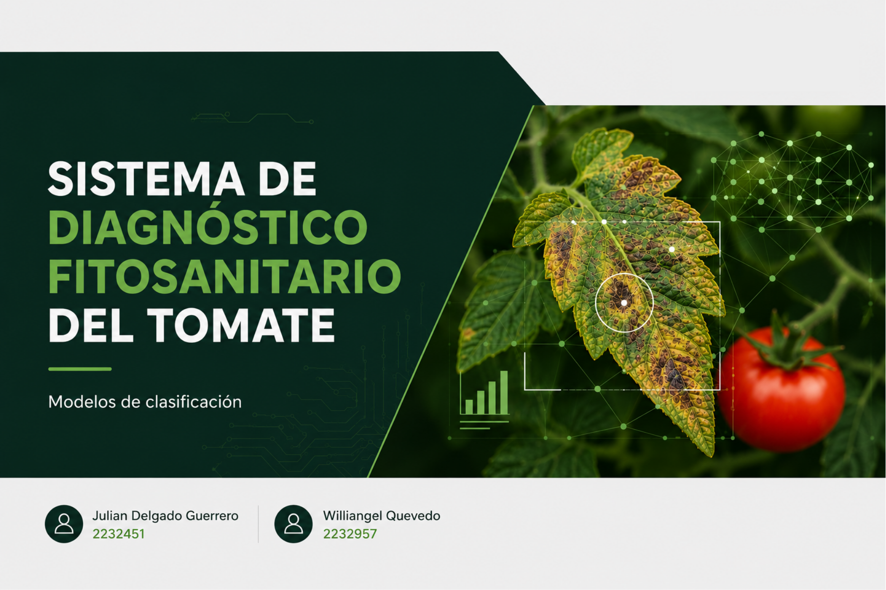

# Sistema de Diagnóstico Fitosanitario del Tomate
### Clasificación de Enfermedades en Hojas de Tomate mediante Aprendizaje Automático

---

## Autores

| Nombre |
|--------|
| Williangel Quevedo |
| Hermes Delgado |

---

## Objetivo

Desarrollar modelos de aprendizaje automático que permitan **clasificar el estado fitosanitario de plantas de tomate** a partir de imágenes de sus hojas, identificando si la planta está sana o presenta alguna de **3 enfermedades**, con el fin de apoyar la agricultura de precisión, la detección temprana de patologías y la reducción de pérdidas en cultivos.

---

## Dataset Utilizado

### PlantVillage Dataset

El dataset recopila imágenes de hojas de tomate clasificadas por condición sanitaria, disponible en [Kaggle](https://www.kaggle.com/datasets/abdallahalidev/plantvillage-dataset).

| Atributo | Detalle |
|----------|---------|
| Clases | 4 (Sana + 3 enfermedades) |
| Total de muestras | ~10,075 |
| Features extraídas | 29 |
| Formato almacenamiento | `.parquet` |
| Balance | Desbalanceado por clase |

Las imágenes fueron procesadas para extraer características visuales almacenadas en un archivo `features.parquet`, que se carga desde Google Drive en Colab.

---

## Modelos Utilizados

### Supervisados

| Modelo | Sigla |
|--------|-------|
| Decision Tree | DT |
| Gaussian Naive Bayes | GNB |
| Random Forest | RF |
| Support Vector Machine | SVM |
| Deep Neural Network | DNN |

### No Supervisados

#### Clustering

| Modelo |
|--------|
| KMeans |
| DBSCAN |

#### Reducción de Dimensionalidad

| Técnica |
|---------|
| PCA |
| t-SNE |

---

## Enlaces

| Recurso | Link |
|---------|------|
| Video | [YouTube](#) |
| Notebook Funcional | [Google Colab](https://colab.research.google.com/drive/14OqVR6-_4uRwPPuiyz8_1zZrbksHxJkq?usp=sharing) |
| Presentación | [Diapositivas](https://canva.link/28qijb1dwxftrtt) |
| Repositorio | [GitHub](https://github.com/Whelee09/NeuralAgro-Diagnostic) |

---

> *Universidad Industrial de Santander — Inteligencia Artificial I — 2026-1*
